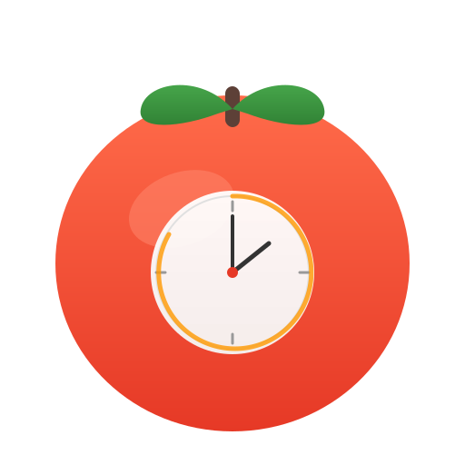

# MenuBarTimer

<p align="center">
  
</p>

<p align="center">
  A lightweight Pomodoro timer for the macOS menu bar. Built with SwiftUI.
</p>

<p align="center">
  <a href="https://developer.apple.com/swift/"></a>
  <a href="https://github.com/sealovesky/MenuBarTimer/releases"></a>
  <a href="LICENSE"></a>
  <a href="https://github.com/sealovesky/MenuBarTimer/stargazers"></a>
</p>

<p align="center">
  
  
</p>

[English](#english) | [中文](#中文)

---

## English

### Introduction

MenuBarTimer is a clean, native macOS Pomodoro timer that lives in your menu bar. It helps you stay focused using the Pomodoro Technique with customizable work and break intervals, session statistics, and automatic mode transitions.

### Features

#### Pomodoro Timer
- **Focus** — 25-minute work sessions (customizable)
- **Short Break** — 5-minute breaks (customizable)
- **Long Break** — 15-minute breaks (customizable)
- Automatic mode switching after each session
- Optional auto-start for the next session

#### Menu Bar Integration
- Displays live countdown in menu bar when running
- Timer icon when idle
- Compact window with circular progress ring

#### Statistics
- Daily pomodoro count tracking
- 7-day bar chart with today highlighted
- Weekly summary
- Data persisted across app restarts

#### Settings
- Custom durations for focus, short break, and long break
- Configurable long break interval (every N pomodoros)
- Auto start next session toggle
- Launch at login

#### Other
- System notifications on session completion
- Date-based timer (accurate across sleep/wake)
- Auto-cleanup of history data older than 30 days
- Smooth page transition animations

### Screenshots

<p align="center">
  <i>Screenshots coming soon</i>
</p>

### Installation

#### Requirements
- macOS 13.0 (Ventura) or later
- Xcode 14.0 or later (for building from source)

#### From Source

```bash
# Clone the repository
git clone https://github.com/sealovesky/MenuBarTimer.git
cd MenuBarTimer

# Open in Xcode
open MenuBarTimer.xcodeproj

# Build and run (⌘R)
```

Or build from command line:

```bash
xcodebuild -scheme MenuBarTimer -configuration Release build
```

#### Download Release

Check the [Releases](https://github.com/sealovesky/MenuBarTimer/releases) page for pre-built binaries.

### Usage

1. **Launch** — MenuBarTimer appears in your menu bar as a timer icon
2. **Click** — Click the icon to open the timer panel
3. **Choose Mode** — Select Focus, Short Break, or Long Break
4. **Start** — Press the play button to begin the countdown
5. **Stats** — Click "Stats" to view your 7-day history
6. **Settings** — Click "Settings" to customize durations and preferences

### Project Structure

```
MenuBarTimer/
├── MenuBarTimerApp.swift        # App entry point (MenuBarExtra)
├── TimerManager.swift           # Timer logic, persistence, notifications
├── MenuBarView.swift            # UI: timer, settings, statistics views
├── Assets.xcassets/             # App icon
├── en.lproj/
│   └── Localizable.strings      # English localization
└── zh-Hans.lproj/
    └── Localizable.strings      # Chinese localization
```

### Tech Stack

- **UI Framework**: SwiftUI
- **Scene**: MenuBarExtra (.window style)
- **Notifications**: UserNotifications (UNUserNotificationCenter)
- **Launch at Login**: ServiceManagement (SMAppService)
- **Settings**: UserDefaults
- **Localization**: Localizable.strings (en, zh-Hans)

### Roadmap

- [x] Custom durations
- [x] Auto start next session
- [x] Configurable long break interval
- [x] 7-day statistics with bar chart
- [x] Launch at login
- [x] Localization (English & Chinese)
- [x] App icon
- [ ] Global keyboard shortcuts
- [ ] Notification sound toggle
- [ ] Menu bar icon showing today's count
- [ ] Custom theme colors
- [ ] Data export (CSV)

### License

MIT License - see [LICENSE](LICENSE) for details.

---

## 中文

### 简介

MenuBarTimer 是一款简洁的 macOS 原生菜单栏番茄钟应用。使用番茄工作法帮助你保持专注，支持自定义工作和休息时长、统计数据和自动模式切换。

### 功能特性

#### 番茄钟
- **专注** — 25 分钟工作时段（可自定义）
- **短休息** — 5 分钟休息（可自定义）
- **长休息** — 15 分钟休息（可自定义）
- 每个时段结束后自动切换模式
- 可选自动开始下一个时段

#### 菜单栏集成
- 运行时在菜单栏显示实时倒计时
- 空闲时显示计时器图标
- 紧凑的弹出窗口，带圆形进度环

#### 统计
- 每日番茄完成数追踪
- 近 7 天柱状图，今日高亮
- 本周汇总
- 数据持久化，重启不丢失

#### 设置
- 自定义专注、短休息、长休息时长
- 可配置长休息间隔（每 N 个番茄后）
- 自动开始下一轮开关
- 开机自启动

#### 其他
- 时段完成时发送系统通知
- 基于时间差的计时器（休眠唤醒后依然准确）
- 自动清理 30 天前的历史数据
- 页面切换平滑动画

### 截图

<p align="center">
  <i>截图即将上线</i>
</p>

### 安装

#### 环境要求
- macOS 13.0 (Ventura) 或更高版本
- Xcode 14.0 或更高版本（从源码构建）

#### 从源码构建

```bash
# 克隆仓库
git clone https://github.com/sealovesky/MenuBarTimer.git
cd MenuBarTimer

# 用 Xcode 打开
open MenuBarTimer.xcodeproj

# 构建运行 (⌘R)
```

或使用命令行构建：

```bash
xcodebuild -scheme MenuBarTimer -configuration Release build
```

#### 下载发布版

前往 [Releases](https://github.com/sealovesky/MenuBarTimer/releases) 页面下载预编译版本。

### 使用方法

1. **启动** — MenuBarTimer 会出现在菜单栏，显示为计时器图标
2. **点击** — 点击图标打开计时面板
3. **选择模式** — 选择专注、短休息或长休息
4. **开始** — 按下播放按钮开始倒计时
5. **统计** — 点击「统计」查看近 7 天记录
6. **设置** — 点击「设置」自定义时长和偏好

### 项目结构

```
MenuBarTimer/
├── MenuBarTimerApp.swift        # 应用入口 (MenuBarExtra)
├── TimerManager.swift           # 计时器逻辑、持久化、通知
├── MenuBarView.swift            # UI：计时器、设置、统计页面
├── Assets.xcassets/             # 应用图标
├── en.lproj/
│   └── Localizable.strings      # 英文本地化
└── zh-Hans.lproj/
    └── Localizable.strings      # 中文本地化
```

### 技术栈

- **UI 框架**: SwiftUI
- **场景**: MenuBarExtra（.window 样式）
- **通知**: UserNotifications (UNUserNotificationCenter)
- **开机自启**: ServiceManagement (SMAppService)
- **设置存储**: UserDefaults
- **本地化**: Localizable.strings (en, zh-Hans)

### 开发计划

- [x] 自定义时长
- [x] 自动开始下一轮
- [x] 可配置长休息间隔
- [x] 近 7 天柱状图统计
- [x] 开机自启动
- [x] 多语言支持（中文/英文）
- [x] 应用图标
- [ ] 全局快捷键
- [ ] 通知声音开关
- [ ] 菜单栏显示今日番茄数
- [ ] 自定义主题颜色
- [ ] 数据导出（CSV）

### 许可证

MIT License - 详见 [LICENSE](LICENSE)

---

## Contributing

Contributions are welcome! Please feel free to submit a Pull Request.

1. Fork the repository
2. Create your feature branch (`git checkout -b feature/AmazingFeature`)
3. Commit your changes (`git commit -m 'Add some AmazingFeature'`)
4. Push to the branch (`git push origin feature/AmazingFeature`)
5. Open a Pull Request

## Acknowledgments

- Inspired by the [Pomodoro Technique](https://en.wikipedia.org/wiki/Pomodoro_Technique) by Francesco Cirillo
- Built with SwiftUI and native macOS frameworks
